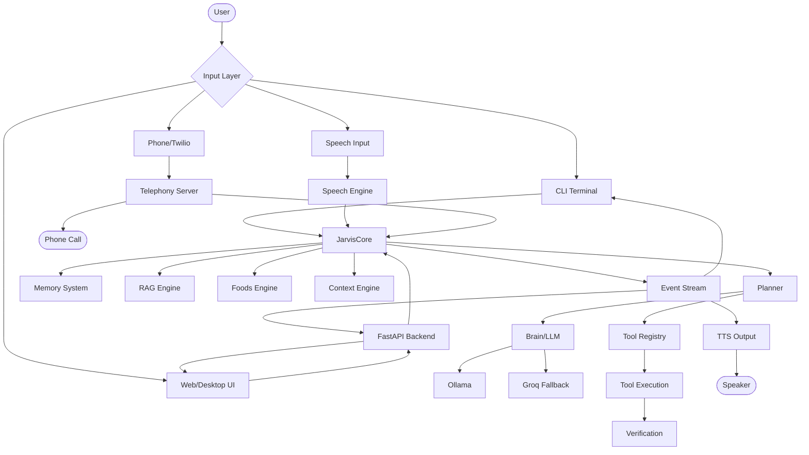
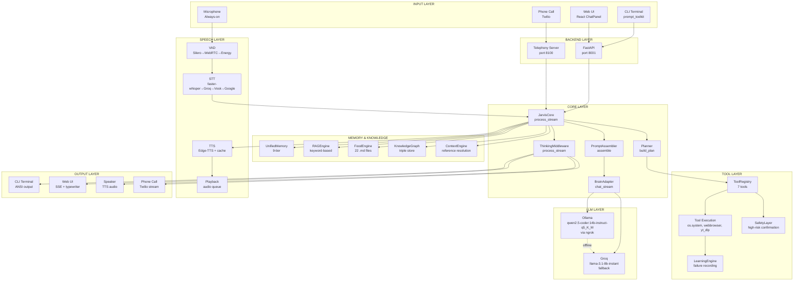

# JARVIS — Complete Internal Architecture & Workflow Documentation

> Generated from source code inspection. Every component described here exists in the repository unless explicitly marked otherwise.

---

## Table of Contents

1. [JARVIS Overview](#1-jarvis-overview)
2. [Complete Repository Map](#2-complete-repository-map)
3. [CLI Version](#3-cli-version)
4. [Web / Desktop Version](#4-web--desktop-version)
5. [User Input Pipeline](#5-user-input-pipeline)
6. [Language & NLP System](#6-language--nlp-system)
7. [Brain / LLM](#7-brain--llm)
8. [Thinking / Reasoning](#8-thinking--reasoning)
9. [Foods System](#9-foods-system)
10. [Memory](#10-memory)
11. [RAG / Knowledge](#11-rag--knowledge)
12. [Tool System](#12-tool-system)
13. [Code Generation / Fallback Execution](#13-code-generation--fallback-execution)
14. [Execution Engine](#14-execution-engine)
15. [Verification](#15-verification)
16. [Error Recovery](#16-error-recovery)
17. [Speech System](#17-speech-system)
18. [Vision System](#18-vision-system)
19. [Frontend Event Flow](#19-frontend-event-flow)
20. [Backend API](#20-backend-api)
21. [Configuration & Environment](#21-configuration--environment)
22. [Complete End-to-End Examples](#22-complete-end-to-end-examples)
23. [CLI vs Web Comparison](#23-cli-vs-web-comparison)
24. [Actual Architecture Diagram](#24-actual-architecture-diagram)
25. [The JARVIS Brain Explanation](#25-the-jarvis-brain-explanation)
26. [What Is Actually Intelligent?](#26-what-is-actually-intelligent)
27. [Bottlenecks & Limitations](#27-bottlenecks--limitations)
28. [Actual vs Planned](#28-actual-vs-planned)
29. [Final Mental Model](#29-final-mental-model)

---

## 1. JARVIS Overview

JARVIS is an AI operating system built by a 15-year-old developer (Abhinav Yadav from Dostpur, Azamgarh, UP, India). It is a personal assistant that integrates LLM-based reasoning with desktop automation, memory, speech, and a rich web UI.

### Main Entrypoints

| Entrypoint | File | Purpose |
|-----------|------|---------|
| CLI | `main.py` → `interface/cli.py` | Terminal-based text/voice interaction |
| Desktop Backend | `jarvis-desktop/backend/app.py` | FastAPI server for the Web UI |
| Desktop Frontend | `jarvis-desktop/frontend/src/App.tsx` | React-based desktop UI |
| Electron | `jarvis-desktop/electron/main.js` | Native desktop wrapper |
| Telephony | `interface/telephony/twilio_server.py` | Twilio voice call integration |
| Core Singleton | `app.py` → `core/jarvis_core.py` | Shared brain used by all interfaces |

### Main LLM Provider

- **Primary:** Ollama (qwen2.5-coder:14b-instruct-q5_K_M) via ngrok tunnel
- **Fallback:** Groq (llama-3.1-8b-instant) — automatic when Ollama is offline
- **Other supported:** OpenAI, Anthropic, Gemini, OpenRouter, LM Studio (configured but not primary)

### Main Execution System

- `core/execution_first.py` — Production execution runtime (replaces legacy `execution.py`, `planner_engine.py`, `tool_chain_engine.py`)
- `core/tools_registry.py` — Unified tool registry with candidate search
- `core/planner.py` — Deterministic intent classification and plan building

### Memory Architecture

- 9-tier hybrid memory (session cache, facts, preferences, goals, projects, relationships, episodic, knowledge graph, conversation store)
- Storage: JSON files in `memory/` directory
- No vector database at runtime — retrieval is keyword-based

### Knowledge/RAG Architecture

- `core/rag.py` — Keyword-overlap scoring (no embeddings)
- Sources: `docs/`, `foods/`, `tool_docs/` markdown files
- Chunking: ~1500 chars with ~150 char overlap
- Top-K: 0-12 depending on intent

### Tool Architecture

- 7 registered tools: open_application, web_search, youtube_video_info, youtube_download, youtube_search, instagram_user_info, instagram_posts
- Semantic routing via `_QUERY_TOOL_MAP` phrase matching
- Safety layer for high-risk tools (delete, shutdown, restart)

### Speech Architecture

- **STT:** Cascading chain — faster-whisper → Groq Whisper → Vosk → Google
- **TTS:** Edge-TTS (primary) with disk cache
- **VAD:** Silero (neural) → WebRTC → Energy (adaptive)
- **Pipeline:** Always-on mic → VAD → Endpoint detection → STT → Handler → TTS → Playback

### Vision Architecture

- Screenshot capture via pyautogui
- OCR via pytesseract
- Camera capture via OpenCV
- Object detection, scene understanding, face recognition: **STATUS: NOT IMPLEMENTED (stubs only)**

### Frontend Architecture

- React 18 + TypeScript + Vite
- Zustand state management (persisted to localStorage)
- Framer Motion animations
- Tailwind CSS styling
- Recharts for system stats
- @tanstack/react-virtual for message virtualization

### Backend Architecture

- FastAPI + Uvicorn on port 8001
- REST API + WebSocket + SSE streaming
- Lazy singleton JARVIS instance with boot lock
- Log broadcasting system (FrontendLogHandler → WebSocket)
- System stats broadcasting every 2 seconds

### High-Level Architecture Diagram



---

## 2. Complete Repository Map

### Core Files

| Path | Purpose | Key Classes/Functions | Status |
|------|---------|----------------------|--------|
| `core/jarvis_core.py` | Master orchestrator singleton | `JarvisCore`, `process_stream()` | Active |
| `core/brain_adapter.py` | Provider-agnostic LLM adapter | `BrainAdapter`, `chat_stream()`, `_stream_ollama()`, `_stream_groq()` | Active |
| `core/brain.py` | Core LLM interface | `Brain`, `think()`, `generate()` | Active |
| `core/qwen3_brain.py` | Qwen3-specific brain | `Qwen3Brain` | Active |
| `core/router.py` | AI provider router | `OllamaProvider`, `GroqProvider`, `ModelRouter` | Active |
| `core/planner.py` | Intent classification & plan building | `PlannerEngine`, `build_plan()` | Active |
| `core/prompt_assembler.py` | Prompt compilation | `PromptAssembler`, `assemble()` | Active |
| `core/tools_registry.py` | Unified tool registry | `UnifiedToolRegistry`, `classify_input()`, `search_candidates()` | Active |
| `core/tools.py` | Built-in tools | Web search, file ops, clipboard, system | Active |
| `core/tools_enhanced.py` | Extended tool set | System control, clipboard, browser | Active |
| `core/execution_first.py` | Production execution runtime | `ExecutionEngine`, `execute()` | Active |
| `core/execution.py` | Old execution engine | `ExecutionEngine` | DEPRECATED |
| `core/planner_engine.py` | Old planner | `PlannerEngine` | DEPRECATED |
| `core/tool_chain_engine.py` | Old tool chaining | `ToolChainEngine` | DEPRECATED |
| `core/memory.py` | 9-tier memory system | `UnifiedMemory`, `search()`, `get_memory_summary()` | Active |
| `core/rag.py` | RAG engine (keyword-based) | `DynamicRAGEngine`, `retrieve()`, `format_rag_context()` | Active |
| `core/foods.py` | Dynamic food prompt compiler | `DynamicFoodEngine`, `get_food_for_intent()` | Active |
| `core/context_engine.py` | Context & reference resolution | `ContextEngine`, `resolve_reference()` | Active |
| `core/events.py` | 12 event types | `ThinkingEvent`, `PlannerEvent`, `ExecutionEvent`, `FinalResponse`, etc. | Active |
| `core/thinking_middleware.py` | Thinking block parser | `ThinkingMiddleware`, `process_stream()` | Active |
| `core/safety.py` | Safety layer | `SafetyLayer`, `is_high_risk()`, `request_confirmation()` | Active |
| `core/learning_engine.py` | Failure learning | `LearningEngine`, `record_failure()` | Active |
| `core/knowledge_graph.py` | Entity-relation graph | `KnowledgeGraphEngine`, `add_relation()`, `query()` | Active |
| `core/goal_manager.py` | Goal tracking | `GoalManager`, `add_goal()`, `get_active_goals()` | Active |
| `core/world_state.py` | Environment state | `WorldStateEngine`, `update()`, `get_context_summary()` | Active |
| `core/profiles.py` | Response profiles | `ProfileManager`, `select_profile()` | Active |
| `core/conversation_store.py` | Conversation persistence | `ConversationStore`, `append()`, `messages()` | Active |
| `core/context.py` | Context utilities | Utility functions | Active |
| `core/vision_engine.py` | Vision capabilities | `VisionEngine`, `take_screenshot()`, `perform_ocr()` | Partial |
| `core/skill_manager.py` | Skill loading | `SkillManager`, `find_skill()` | Minimal |
| `core/diagnostics.py` | System diagnostics | `SelfDiagnostics`, `run_diagnostics()` | Partial |
| `core/performance_manager.py` | Performance adaptation | `PerformanceManager`, `adapt_parameters()` | Active |
| `core/background_workers.py` | Thread pool | `BackgroundWorkerPool`, `submit_task()` | Active |
| `core/cache.py` | Caching layer | Cache utilities | Active |
| `core/model_manager.py` | Model management | Model loading utilities | Active |
| `core/speech_engine.py` | Legacy speech engine | `SpeechEngine` | DEPRECATED |

### Interface Files

| Path | Purpose | Key Classes/Functions | Status |
|------|---------|----------------------|--------|
| `interface/cli.py` | Active CLI with Rich + prompt_toolkit | `TextMode`, `main()` | Active |
| `interface/cli_new.py` | Event-driven CLI | Alternative CLI | Active |
| `interface/desktop.py` | Desktop monitor (psutil) | `DesktopMonitor`, `format_status()` | Active |
| `interface/speech.py` | Speech facade (re-exports) | Re-exports from `speech/` | Facade |
| `interface/speech_new.py` | New speech interface | — | DEPRECATED |
| `interface/telephony/config.py` | Telephony config | `TelephonyConfig` | Active |
| `interface/telephony/twilio_server.py` | Twilio FastAPI server | `create_voice_app()` | Active |
| `interface/telephony/session.py` | Call session management | `CallSession` | Active |
| `interface/telephony/call_manager.py` | Active call tracking | `CallManager` | Active |
| `interface/telephony/speech.py` | STT abstraction | `SpeechRecognizer` | Active |
| `interface/telephony/streaming.py` | Audio streaming | `TwilioStreamHandler`, `AudioBuffer` | Active |
| `interface/telephony/logger.py` | Call logging | `CallLogger` | Active |
| `interface/telephony/cli_display.py` | CLI call display | Display functions | Active |

### Speech Files

| Path | Purpose | Key Classes/Functions | Status |
|------|---------|----------------------|--------|
| `speech/speech_engine.py` | Production speech orchestrator | `SpeechEngine`, `run_conversation()`, `speak()` | Active |
| `speech/config.py` | All speech settings | `SpeechConfig` | Active |
| `speech/recognizer.py` | Cascading STT | `Recognizer`, `transcribe()` | Active |
| `speech/vad.py` | Voice activity detection | `CompositeVAD` (Silero→WebRTC→Energy) | Active |
| `speech/edge_provider.py` | Edge-TTS with cache | `EdgeTTSProvider`, `synthesize()` | Active |
| `speech/endpoint_detector.py` | Speech endpoint detection | `EndpointDetector` | Active |
| `speech/playback.py` | Audio playback worker | Playback utilities | Active |
| `speech/streaming.py` | Utterance grabbing | `UtteranceGrabber`, `SentenceSplitter` | Active |
| `speech/interrupt_manager.py` | Barge-in control | `InterruptManager` | Active (disabled) |
| `speech/queue.py` | Speech task queue | `SpeechQueue` | Active |
| `speech/cache.py` | Audio cache | `AudioCache` | Active |
| `speech/events.py` | Speech event bus | `event_bus`, `SpeechEventType` | Active |
| `speech/logger.py` | Conversation logging | `conversation_view` | Active |
| `speech/benchmark.py` | Latency recording | `latency_recorder` | Active |

### Entry Points

| Path | Purpose | Status |
|------|---------|--------|
| `main.py` | CLI entry (delegates to `interface/cli.py`) | Active |
| `app.py` | Root JARVIS class (boot, handle, health) | Active |
| `jarvis-desktop/backend/app.py` | Desktop backend (FastAPI) | Active |
| `jarvis-desktop/frontend/src/App.tsx` | Desktop frontend (React) | Active |
| `jarvis-desktop/electron/main.js` | Electron main process | Active |

### Data Files

| Path | Purpose | Format |
|------|---------|--------|
| `memory/facts.json` | User facts (name, creator) | JSON dict |
| `memory/preferences.json` | User preferences | JSON dict |
| `memory/goals.json` | Active goals | JSON list |
| `memory/projects.json` | Projects | JSON |
| `memory/relationships.json` | People relationships | JSON |
| `memory/episodic.json` | Episodic memories | JSON list |
| `memory/knowledge_graph.json` | Entity-relation triples | JSON list |
| `memory/mistakes.json` | Learning from failures | JSON list |
| `memory/patterns.json` | Learning patterns | JSON list |
| `convo/conversations.json` | Conversation history (200 turns) | JSON list |
| `data/settings.json` | User settings | JSON |
| `foods/*.md` | 22 prompt instruction files | Markdown |

---

## 3. CLI Version

### Startup Flow

```
python main.py
    ↓
main.py: Fixes Windows encoding, quiets HTTP libs
    ↓
interface/cli.py: main() called
    ↓
Argument parsing: --text, --voice, --api, --debug, --health
    ↓
If --health: Show system status via desktop.format_status(), exit
    ↓
If no flags: Show interactive menu
    1. Text Mode
    2. Speech Mode
    3. Debug Mode
    4. Exit
    ↓
Boot JARVIS:
    from interface/app.py import JARVIS
    jarvis = JARVIS()
    await jarvis.boot()
        ↓
    core/jarvis_core.py: JarvisCore.boot()
        → self_diagnostics.run_diagnostics()
        → background_workers.submit_task(self._async_warmup_runner)
        → self._booted = True
        ↓
    brain_adapter.warmup() (background thread)
        → Sends "hi" to Ollama to warm up model
    ↓
Start TextMode or VoiceMode
```

### Text Mode Interaction

```
TextMode.run()
    ↓
Clear screen, enable ANSI on Windows
    ↓
Loop:
    user_input = get_input()  # prompt_toolkit with history
    ↓
    Handle commands:
        quit/exit/q → shutdown and exit
        debug → toggle debug mode
        health → show system status
        tools → list all tools in Rich table
    ↓
    _handle_streaming(user_input):
        ↓
        jarvis.handle(user_input)  # calls core.process_stream()
            ↓
        Streams tokens via ThinkingMiddleware
            ↓
        Thinking tokens (prefixed with \x00): displayed in dim/grey
        Response tokens: displayed in real-time
            ↓
        Print newline after stream completes
```

### Example: "hello"

```
User: hello
    ↓
TextMode._handle_streaming("hello")
    ↓
jarvis.handle("hello")
    ↓
core/jarvis_core.py: process_stream("hello")
    ↓
world_state_engine.update(last_user_request="hello")
    ↓
unified_memory.search("hello") → no match
    ↓
planner_engine.build_plan("hello")
    → Matches _CONVERSATION_PATTERNS
    → plan.profile = "FAST"
    → plan.requires_tools = False
    → plan.confidence = 0.99
    → steps: [ExecutionStep(action_type="response", target="conversation")]
    ↓
PlannerEvent yielded
    ↓
prompt_assembler.assemble("hello", plan)
    → System prompt: JARVIS identity + food text (00_identity.md) + world state
    → No memory context (plan.requires_memory = False)
    → No RAG context (plan.requires_rag = False)
    → No tool cards (plan.requires_tools = False)
    → No conversation history
    → Messages: [system_prompt, "hello"]
    ↓
brain_adapter.chat_stream(messages, temperature=0.25, max_tokens=1024)
    ↓
_stream_ollama(messages, "qwen2.5-coder:14b-instruct-q5_K_M", ...)
    → POST https://...ngrok.../api/chat
    → Streaming tokens from Ollama
    ↓
ThinkingMiddleware.process_stream(raw_stream)
    → No <think> blocks (FAST profile, think=False)
    → Yields FinalResponseToken events
    ↓
FinalResponse yielded
    ↓
TextMode prints each token as it arrives
    ↓
"Hello Abhinav! How can I help you today?" displayed
```

### Example: "open YouTube"

```
User: open YouTube
    ↓
planner_engine.build_plan("open YouTube")
    → Matches _EXTERNAL_ACTION_PATTERNS ("open ")
    → plan.requires_tools = True
    → plan.profile = "FAST"
    → steps: [ExecutionStep(action_type="tool", target="tool_execution")]
    ↓
jarvis_core: plan.requires_tools = True
    ↓
tool_registry.classify_input("open YouTube")
    → _QUERY_TOOL_MAP: ("open ", "open_application", "app_name")
    → Returns: ("open_application", "app_name", "youtube")
    ↓
safety_layer.is_high_risk("open_application") → False
    ↓
ExecutionEvent(target_name="open_application", status="executing") yielded
    ↓
tool_registry.execute("open_application", app_name="youtube")
    → _handle_open_application("youtube")
    → os.system('start "" "youtube"')
    → Returns: {"success": True, "output": "Launched youtube"}
    ↓
VerificationEvent yielded
    ↓
FinalResponse(text="Launched youtube") yielded
    ↓
CLI prints: "Launched youtube"
```

### Example: "write a Python calculator"

```
User: write a Python calculator
    ↓
planner_engine.build_plan("write a Python calculator")
    → Matches _WRITING_PATTERNS ("write", "python code")
    → plan.requires_tools = False  ← KEY: writing does NOT trigger tools
    → plan.profile = "CODING"
    → plan.requires_rag = True
    → plan.top_k_rag = 4
    ↓
prompt_assembler.assemble(...)
    → System prompt + food text (coding.md or 01_execution.md)
    → RAG context: 4 relevant documentation chunks
    → Messages assembled
    ↓
brain_adapter.chat_stream(...)
    → Ollama generates Python code
    → Tokens stream back
    ↓
FinalResponse with full Python calculator code
```

---

## 4. Web / Desktop Version

### Architecture Flow

```
Browser / Electron
    ↓
React Frontend (Vite, port 5173)
    ↓
HTTP POST /api/chat  (or WebSocket ws://localhost:8001/ws)
    ↓
FastAPI Backend (port 8001)
    ↓
get_jarvis() → lazy singleton with boot lock
    ↓
jarvis._core.process_stream(message)
    ↓
Same core pipeline as CLI
    ↓
Event stream → SSE tokens → Frontend typewriter display
```

### Backend Entrypoint

`jarvis-desktop/backend/app.py` — FastAPI application

**Startup (lifespan):**
1. `process_log_broadcasts()` — background task, pushes logs to WebSocket every 100ms
2. `broadcast_system_stats()` — background task, pushes psutil stats every 2 seconds
3. `get_jarvis()` — boots JARVIS singleton with configurable timeout

**How JARVIS is loaded:**
```python
import importlib.util
root_app = importlib.util.module_from_spec(spec)  # app.py at project root
spec.loader.exec_module(root_app)
jarvis_instance = root_app.JARVIS()
await jarvis_instance.boot()
```

### Frontend Entrypoint

`jarvis-desktop/frontend/src/App.tsx` — Root React component

**Layout:**
- Background: Video loop (`bcg.webm`)
- Loading: Cinematic `LoadingScreen` on boot (5-second animation)
- Left: `Sidebar` (auto-hide, starts collapsed at 64px)
- Center: `TopBar` + active section content
- Right: `RightPanel` (auto-hide, shows system stats)

**Section routing via `activeTab`:**

| Tab | Component |
|-----|-----------|
| home | HomeSection |
| dashboard | DashboardSection |
| pc-control | PCControlSection |
| memory | MemorySection |
| logs | LogsSection |
| phone | PhoneSection |
| assistant | ChatPanel |
| settings | SettingsSection |
| help | DocsSection |

### Chat Message Flow (Frontend)

```
User types message in ChatPanel
    ↓
handleSend() called
    ↓
POST /api/chat { message, session_id, stream: true }
    ↓
Backend returns SSE stream
    ↓
Frontend reads ReadableStream via reader.read()
    ↓
Parses SSE lines: data: {"token": "..."}
    ↓
Accumulates tokens in fullResponse
    ↓
setInterval (20ms) renders characters progressively (typewriter effect)
    ↓
On data.done: sets final response, actions, metadata
    ↓
Message displayed in chat with action buttons
```

### Streaming Response Format (SSE)

```
data: {"token": "Hello"}
data: {"token": " world"}
data: {"token": "!"}
data: {"done": true, "response": "Hello world!", "actions": [...], "intent": "conversation", "intent_confidence": 0.99, "tool": "", "verified": false, "total_ms": 1234}
```

### State Management (Zustand)

**Persisted to localStorage** (`jarvis-storage`):
- `mode` (text/speech)
- `todos`, `notes`, `reminders`
- `sessions`, `chatExpandMode`

**Runtime state:**
- `messages: Message[]` — chat history
- `systemStats` — live CPU/RAM/battery
- `isConnected` — WebSocket status
- `isTyping` — AI processing indicator
- `activeTab` — current section
- `plugins` — Vision, OCR, File AI, Browser Agent, Local LLM

### WebSocket Endpoints

| Path | Purpose |
|------|---------|
| `ws://localhost:8001/ws` | Main WebSocket — system stats, chat events |
| `ws://localhost:8001/ws/logs` | Real-time log streaming |
| `ws://localhost:8100/ws/phone` | Phone panel call state updates |

---

## 5. User Input Pipeline

### Stage 1: Input Reception

**Stage:** Input Reception
**File:** `interface/cli.py` (CLI) or `jarvis-desktop/backend/app.py` (Web)
**Class:** `TextMode` (CLI) or `chat()` endpoint (Web)
**Input:** Raw user string
**Processing:** CLI: `prompt_toolkit.PromptSession` with history. Web: JSON body parsing.
**Output:** Raw string
**Next stage:** Desktop food injection (Web only) / Direct to core
**Failure behavior:** CLI falls back to `input()`. Web returns error JSON.

### Stage 2: Desktop Food Injection (Web only)

**Stage:** Context Injection
**File:** `jarvis-desktop/backend/app.py`
**Function:** `get_desktop_food()`
**Input:** User message string
**Processing:** Collects CPU%, memory% via psutil. Prepends `[Desktop UI Context]` header.
**Output:** Augmented message: `[Desktop UI Context]\nchannel: jarvis-desktop\ncpu_percent: XX\nmemory_percent: XX\n\nUser Message: <message>`
**Next stage:** JARVIS Core
**Failure behavior:** Empty context string, message passed through.

### Stage 3: World State Update

**Stage:** World State
**File:** `core/world_state.py`
**Class:** `WorldStateEngine`
**Function:** `update(last_user_request=user_input)`
**Input:** User input string
**Processing:** Stores the latest user request in the WorldState dataclass.
**Output:** Updated world state
**Next stage:** Memory Lookup
**Failure behavior:** Non-critical, continues.

### Stage 4: Memory Lookup

**Stage:** Memory
**File:** `core/memory.py`
**Class:** `UnifiedMemory`
**Function:** `search(query)`
**Input:** User query string
**Processing:** Hybrid lookup: checks facts dict, preferences dict, goals list. Returns first match via substring matching.
**Output:** Memory hit string or None
**Next stage:** Planner
**Failure behavior:** Returns None, continues without memory.

### Stage 5: Intent Classification & Planning

**Stage:** Planner
**File:** `core/planner.py`
**Class:** `PlannerEngine`
**Function:** `build_plan(query)`
**Input:** User query string
**Processing:** Regex pattern matching against 5 pattern sets:
  1. `_CONVERSATION_PATTERNS` — greetings, chat, "don't use tools"
  2. `_MEMORY_PATTERNS` — "remember", "what is my", "save"
  3. `_EXTERNAL_ACTION_PATTERNS` — "open", "search google", "youtube search"
  4. `_WRITING_PATTERNS` — "write", "translate", "essay", "code"
  5. `_KNOWLEDGE_PATTERNS` — "what is", "explain", "how does"
**Output:** `ExecutionPlan` with profile, requires_tools, requires_memory, requires_rag, confidence, steps
**Next stage:** Tool execution (if requires_tools) or Prompt assembly
**Failure behavior:** Defaults to general knowledge plan.

### Stage 6: Tool Classification (if requires_tools)

**Stage:** Tool Selection
**File:** `core/tools_registry.py`
**Class:** `UnifiedToolRegistry`
**Function:** `classify_input(query)`
**Input:** User query string
**Processing:** Phrase matching against `_QUERY_TOOL_MAP`. Only explicit external actions trigger tools.
**Output:** `(tool_name, arg_name, arg_value)` or `("", "", "")`
**Next stage:** Tool Execution (if tool matched) or LLM Generation (if no match)
**Failure behavior:** Falls through to LLM generation.

### Stage 7: Prompt Assembly

**Stage:** Prompt Assembly
**File:** `core/prompt_assembler.py`
**Class:** `PromptAssembler`
**Function:** `assemble(query, plan, history, tool_cards)`
**Input:** Query, ExecutionPlan, conversation history, tool cards
**Processing:** Builds message list with token budget:
  1. System prompt (~500 tokens): JARVIS identity + food text + world state + tool cards
  2. Memory context (~250 tokens): if plan.requires_memory
  3. RAG context (~800 tokens): if plan.requires_rag
  4. Conversation history (~1000 tokens): last 8 messages
  5. Current user query
**Output:** `AssembledPrompt` with messages list and max_tokens
**Next stage:** LLM
**Failure behavior:** Skips missing components, proceeds with available context.

### Stage 8: LLM Generation

**Stage:** LLM
**File:** `core/brain_adapter.py`
**Class:** `BrainAdapter`
**Function:** `chat_stream(messages, temperature, max_tokens)`
**Input:** Assembled messages
**Processing:** Sends to Ollama via ngrok tunnel. If Ollama offline, falls back to Groq.
**Output:** Async generator of tokens
**Next stage:** Thinking Middleware
**Failure behavior:** Falls back to Groq. If both fail, yields error message.

### Stage 9: Thinking Middleware

**Stage:** Thinking/Reasoning
**File:** `core/thinking_middleware.py`
**Class:** `ThinkingMiddleware`
**Function:** `process_stream(raw_stream)`
**Input:** Raw token stream from LLM
**Processing:** Parses `<think>...</think>` blocks. Yields ThinkingEvent for reasoning, FinalResponseToken for response.
**Output:** Typed event stream
**Next stage:** Response collection
**Failure behavior:** If `<think>` never closes, releases held tokens as response.

### Stage 10: Response Collection

**Stage:** Response
**File:** `core/jarvis_core.py`
**Class:** `JarvisCore`
**Function:** `process_stream()` (continued)
**Input:** Event stream from thinking middleware
**Processing:** Collects all FinalResponseToken events into full_text. Yields FinalResponse at end.
**Output:** FinalResponse event with complete text
**Next stage:** CLI display / SSE stream / Speech

---

## 6. Language & NLP System

### Language Detection

**STATUS: NOT IMPLEMENTED as a dedicated module.**

The system relies on the LLM's inherent multilingual capability. There is no explicit language detection step. The LLM receives the user's input in whatever language they type and responds accordingly.

### Intent Detection

**File:** `core/planner.py`
**Method:** Regex pattern matching (not LLM-based)

| Pattern Set | Examples | Result |
|-------------|----------|--------|
| `_CONVERSATION_PATTERNS` | "hello", "how are you", "don't use tools" | profile=FAST, no tools |
| `_MEMORY_PATTERNS` | "remember", "what is my name" | requires_memory=True |
| `_EXTERNAL_ACTION_PATTERNS` | "open YouTube", "search Google for weather" | requires_tools=True |
| `_WRITING_PATTERNS` | "write essay", "translate to Hindi" | profile=NORMAL, no tools |
| `_KNOWLEDGE_PATTERNS` | "what is AGI", "explain Python" | requires_rag=True |

### Entity Extraction

**STATUS: NOT IMPLEMENTED as a dedicated module.**

Tool arguments are extracted via simple string splitting in `classify_input()`. No NER or entity extraction library is used.

### Command Normalization

**File:** `core/tools_registry.py`
**Function:** `classify_input()`
**Processing:** Lowercases query, strips filler words ("for", "on", "the", "a", "an", "about"), extracts value after trigger phrase.

### Multilingual Handling

** STATUS: LLM-based (implicit)**

The system supports Hindi, Hinglish, Bengali, Korean, Spanish, French, Japanese, and other languages through:
1. The LLM's multilingual training data
2. The default TTS voice `en-IN-PrabhatNeural` (Indian English)
3. STT language config: `JARVIS_SPEECH_STT_LANG` (default: "en")

There is no explicit language routing — the LLM handles all languages naturally.

### Hinglish Handling

**File:** `core/context_engine.py`
**Function:** `resolve_reference()`
**Processing:** Supports Hindi/Urdu pronouns: "wahan" (there), "ye" (this/it), "wo" (that), "woh" (he/she), "ve" (they)

---

## 7. Brain / LLM

### Provider Configuration

| Provider | Endpoint | Model | Priority |
|----------|----------|-------|----------|
| Ollama | `OLLAMA_BASE_URL` (ngrok tunnel) | `qwen2.5-coder:14b-instruct-q5_K_M` | Primary |
| Groq | `https://api.groq.com/openai/v1` | `llama-3.1-8b-instant` | Fallback |
| OpenAI | `OPENAI_BASE_URL` | Configured | Available |
| Anthropic | `ANTHROPIC_BASE_URL` | Configured | Available |
| Gemini | `GOOGLE_AI_BASE_URL` | Configured | Available |
| OpenRouter | `OPENROUTER_BASE_URL` | Configured | Available |

### Model Configuration

| Parameter | Value | Source |
|-----------|-------|--------|
| Temperature | 0.25 | `brain_adapter.py` |
| Top-K | 10 | Ollama options |
| Top-P | 0.9 | Ollama options |
| Num CTX | 16384 | Ollama options |
| Max Tokens | 1024-4096 | Profile-dependent |
| Ollama Timeout | 60s | `OLLAMA_REQUEST_TIMEOUT` |
| Connect Timeout | 10s | `OLLAMA_CONNECT_TIMEOUT` |

### Streaming Behavior

**File:** `core/brain_adapter.py`
**Function:** `_stream_ollama()`
**Processing:** Uses httpx streaming client. Parses each line as JSON, extracts `message.content` token. Yields tokens as they arrive.

### Thinking/Reasoning

**File:** `core/thinking_middleware.py`
**Processing:** If the LLM outputs `<think>...</think>` blocks, they are extracted as `ThinkingEvent` objects. Response tokens outside `<think>` blocks are yielded as `FinalResponseToken`.

### Prompt Assembly

```mermaid
flowchart TD
    SYS[System Prompt<br/>JARVIS identity + Food text<br/>+ World State + Tool Cards] 
    MEM[Memory Context<br/>facts, preferences, goals]
    RAG[RAG Context<br/>relevant documentation chunks]
    HIST[Conversation History<br/>last 8 messages]
    QUERY[User Query]
    
    SYS --> ASSEMBLE[ assemble() ]
    MEM --> ASSEMBLE
    RAG --> ASSEMBLE
    HIST --> ASSEMBLE
    QUERY --> ASSEMBLE
    
    ASSEMBLE --> MSGS[Messages List]
    MSGS --> LLM[Ollama / Groq]
    LLM --> STREAM[Token Stream]
    STREAM --> THINK[ThinkingMiddleware]
    THINK --> RESP[Final Response]
```

### Fallback Behavior

```python
if self.provider == "ollama" and self._ollama_offline:
    # Skip Ollama, go straight to Groq
    async for token in self._stream_groq(...):
        yield token

if self.provider == "ollama":
    ollama_failed = False
    async for token in self._stream_ollama(...):
        if token.startswith("[Ollama"):
            ollama_failed = True
            continue
        yield token
    if ollama_failed or self._ollama_offline:
        # Fall back to Groq
        async for token in self._stream_groq(...):
            yield token
```

---

## 8. Thinking / Reasoning

### How It Works

**File:** `core/thinking_middleware.py`

The LLM (qwen2.5-coder:14b-instruct-q5_K_M) can output `<think>...</think>` blocks for chain-of-thought reasoning. The `ThinkingMiddleware` parses these:

1. Scans incoming tokens for `<think>` and `</think>` tags
2. When `<think>` is found: buffers tokens as reasoning, yields `ThinkingEvent`
3. When `</think>` is found: yields the complete reasoning block
4. Tokens outside `<think>` blocks: yielded as `FinalResponseToken`

### When Thinking Is Enabled

**File:** `core/profiles.py`

| Profile | think | Temperature | Max Tokens |
|---------|-------|-------------|------------|
| FAST | False | 0.2 | 128 |
| NORMAL | False | 0.5 | 512 |
| WRITING | True | 0.7 | 2048 |
| CODING | True | 0.3 | 4096 |
| PROJECT | True | 0.5 | 8192 |

### Internal vs User-Visible

- **ThinkingEvent** (`event_type: "thinking"`): Model's reasoning process. Displayed in dim/grey in CLI. Sent to frontend as thinking metadata.
- **FinalResponseToken** (`event_type: "response_token"`): Actual response text. Displayed normally. Sent to user.

---

## 9. Foods System

### How It Works

**File:** `core/foods.py`
**Class:** `DynamicFoodEngine`
**Directory:** `foods/` (22 markdown files)

### Food Files

| File | Purpose |
|------|---------|
| `00_identity.md` | JARVIS identity, creator info, behavior rules |
| `01_reasoning.md` | "Execution is the default. Think only when ambiguous." |
| `02_tools.md` | Tool usage rules |
| `03_tool_registry.md` | Tool registry instructions |
| `04_memory.md` | Memory handling rules |
| `05_context.md` | Context management rules |
| `06_safety.md` | Safety guidelines |
| `07_desktop.md` | Desktop control instructions |
| `08_speech.md` | Speech behavior rules |
| `09_vision.md` | Vision system rules |
| `10_learning.md` | Learning rules |
| + 12 more | Various behavioral instructions |

### Selection Logic

```python
def get_food_for_intent(self, intent):
    if "code" in intent or "debug" in intent:
        return self._index.get("coding.md") or self._index.get("01_execution.md")
    if "tool" in intent or "open" in intent:
        return self._index.get("tools.md") or self._index.get("03_tool_registry.md")
    if "memory" in intent:
        return self._index.get("memory.md") or self._index.get("04_memory.md")
    if "desktop" in intent:
        return self._index.get("desktop.md") or self._index.get("07_desktop.md")
    return self._index.get("00_identity.md")
```

### Hot Reload

Every call to `get_food_for_intent()` calls `reload()` which checks file `st_mtime`. If a food file was modified, it's reloaded from disk. No restart required.

### Injection

**File:** `core/prompt_assembler.py`

Food text is truncated to 1200 characters and injected into the system prompt:
```
System: You are JARVIS... [identity text]

[Food instructions from selected .md file, truncated to 1200 chars]

[World State context]

[Tool cards if applicable]
```

---

## 10. Memory

### 9-Tier Memory System

**File:** `core/memory.py`
**Class:** `UnifiedMemory`

| Tier | Name | Storage | Search | Status |
|------|------|---------|--------|--------|
| 1 | Session Cache | In-memory dict | Exact key lookup | Active |
| 2 | Recent Conversations | `convo/conversations.json` | N/A (loaded separately) | Active |
| 3 | Facts | `memory/facts.json` | Substring match | Active |
| 4 | Preferences | `memory/preferences.json` | Substring match | Active |
| 5 | Projects | `memory/projects.json` | Loaded, not searched | Present |
| 6 | Relationships | `memory/relationships.json` | Loaded, not searched | Present |
| 7 | Goals | `memory/goals.json` | Substring match | Active |
| 8 | Semantic Vector | `data/vector_store/` | NOT IMPLEMENTED | NOT FOUND |
| 9 | Archived | N/A | N/A | NOT FOUND |

### Episodic Memory

**File:** `core/memory.py`
**Class:** `EpisodicMemory`

Dataclass with: date, location, context, outcome, importance, lessons. Stored in `memory/episodic.json`.

### Knowledge Graph

**File:** `core/knowledge_graph.py`
**Class:** `KnowledgeGraphEngine`

Simple subject-relation-object triple store backed by `memory/knowledge_graph.json`.

Default triples:
- `User --creator--> Abhinav`
- `JARVIS --role--> AI OS`

### Memory Search

```python
def search(self, query):
    # Check facts
    for key, value in self._facts.items():
        if key in query.lower() or query.lower() in key:
            return f"{key}: {value}"
    # Check preferences
    for key, value in self._preferences.items():
        if key in query.lower() or query.lower() in key:
            return f"{key}: {value}"
    # Check goals
    for goal in self._goals:
        if isinstance(goal, dict):
            title = goal.get("title", "")
            if query.lower() in title.lower():
                return f"Goal: {title}"
    return None
```

### Example: "Remember my sister's name is Nancy"

```
User: "remember my sister's name is Nancy"
    ↓
planner_engine.build_plan()
    → Matches _MEMORY_PATTERNS ("remember")
    → plan.requires_memory = True
    ↓
jarvis_core: requires_memory = True
    ↓
unified_memory.set_fact("sister", "Nancy")
    → Writes to memory/facts.json
    ↓
LLM responds: "Got it! I'll remember that your sister's name is Nancy."
```

### Memory Injection

**File:** `core/prompt_assembler.py`

```python
if plan.requires_memory:
    mem_summary = unified_memory.get_memory_summary()
    # Added as system message: "Memory: name: Abhinav, creator: Abhinav, ..."
```

---

## 11. RAG / Knowledge

### Implementation

**File:** `core/rag.py`
**Class:** `DynamicRAGEngine`

### Document Sources

- `docs/**/*.md` — Documentation files
- `foods/**/*.md` — Food instruction files
- `tool_docs/**/*.md` — Tool documentation

### Chunking

- Chunk size: ~1500 characters
- Overlap: ~150 characters
- Method: Simple character-based splitting

### Retrieval

**STATUS: Keyword-overlap scoring (NOT vector-based)**

```python
def retrieve(self, query, top_k=2):
    query_words = set(query.lower().split())
    for chunk in self._chunks:
        chunk_words = set(chunk["text"].lower().split())
        score = len(query_words & chunk_words)
        scored.append((score, chunk))
    scored.sort(reverse=True)
    return scored[:top_k]
```

### Context Injection

**File:** `core/prompt_assembler.py`

```python
if plan.requires_rag:
    rag_context = rag_engine.format_rag_context(query, plan.top_k_rag)
    # Added as system message, hard-capped at 4800 chars (~1200 tokens)
```

### Top-K Selection by Intent

| Intent | Top-K | Max Tokens |
|--------|-------|------------|
| Greeting | 0 | 0 |
| Normal | 2 | 800 |
| Coding | 4 | 1600 |
| Research | 8 | 3200 |

---

## 12. Tool System

### How JARVIS Decides to Use a Tool

```
User request
    ↓
Planner: _EXTERNAL_ACTION_PATTERNS regex check
    ↓
If pattern matches: plan.requires_tools = True
    ↓
classify_input(): _QUERY_TOOL_MAP phrase matching
    ↓
If tool matched: execute tool
    ↓
If no tool matched: fall through to LLM generation
```

### Registered Tools

| Tool | File | Trigger Phrases | Handler |
|------|------|-----------------|---------|
| open_application | `core/tools_registry.py` | "open ", "launch ", "start " | `os.system('start "" "app"')` |
| web_search | `core/tools_registry.py` | "search google", "google search", "search web" | `webbrowser.open()` |
| youtube_search | `core/tools_registry.py` | "search youtube", "youtube search", "find youtube" | `yt_dlp` extract_info |
| youtube_download | `core/tools_registry.py` | "download youtube", "youtube download" | `yt_dlp` download |
| youtube_video_info | `core/tools_registry.py` | "youtube info", "youtube video info" | `yt_dlp` extract_info |
| instagram_user_info | `core/tools_registry.py` | "instagram info", "instagram user" | `instaloader` profile |
| instagram_posts | `core/tools_registry.py` | "instagram posts", "insta posts" | `instaloader` posts |

### Additional Tools (from `core/tools.py`)

| Tool | Purpose |
|------|---------|
| close_application | Kill application by name |
| open_url | Open URL in browser |
| take_screenshot | Capture screenshot |
| adjust_volume | Volume control |
| add_note / get_notes | Note management |
| add_todo / get_todos / complete_todo | Todo management |
| get_system_stats | System information |
| get_time / get_date | Time/date |

### Tool Execution

**File:** `core/tools_registry.py`
**Function:** `execute(tool_name, **kwargs)`

```python
def execute(self, tool_name, **kwargs):
    handler = self._handlers.get(tool_name.lower())
    result = handler(**kwargs)
    verified = self.verify_tool_execution(tool_name, kwargs, result)
    result["verified"] = verified
    return result
```

### Candidate Tool Search

**File:** `core/tools_registry.py`
**Function:** `search_candidates(query, top_k=3)`

Used by the prompt assembler to inject relevant tool cards into the LLM context. Scores tools by:
- Word overlap between query and tool description
- Alias matching (bonus +5)
- Trigger word matching (bonus +20, higher for earlier entries)

---

## 13. Code Generation / Fallback Execution

**STATUS: NOT IMPLEMENTED as a dedicated code execution system.**

There is no mechanism for JARVIS to generate arbitrary code and execute it. The system relies on:
1. Pre-registered tools for known actions
2. The LLM generating code as text output (displayed to user, not executed)
3. `core/execution_first.py` for tool execution (not code execution)

The `core/model_manager.py` references a `run_script` function but this is for internal model management, not user code execution.

---

## 14. Execution Engine

### Production Runtime

**File:** `core/execution_first.py`

This is the production execution engine that replaced the legacy `execution.py`, `planner_engine.py`, and `tool_chain_engine.py`.

### Execution Flow

```
Tool selected by planner
    ↓
Safety check (is_high_risk?)
    ↓
If high-risk: request_confirmation() → wait for token
    ↓
Execute via tool_registry.execute()
    ↓
Verify via tool_registry.verify_tool_execution()
    ↓
Return result
```

### Verification Methods

| Method | Tool | Check |
|--------|------|-------|
| process_found | open_application | `psutil.process_iter()` checks if app process exists |
| file_exists | youtube_download | Checks if downloaded file exists |
| url_loaded | web_search | Checks if URL was opened |
| data_returned | youtube_search, instagram | Checks if data was returned |

---

## 15. Verification

### Process Verification

**File:** `core/tools_registry.py`
**Function:** `verify_tool_execution()`

```python
def verify_tool_execution(self, tool_name, args, result):
    spec = self._registry.get(tool_name)
    if spec.verification_method == "process_found":
        app_name = args.get("app_name", "").lower()
        for proc in psutil.process_iter(['name']):
            if app_name in proc.info['name'].lower():
                return True
        return False
    return True  # Default: assume success
```

### Verification Events

**File:** `core/events.py`

```python
@dataclass
class VerificationEvent(BaseEvent):
    target_name: str
    verified: bool
    details: dict
```

Yielded after every tool execution. The `verified` field is included in the final response sent to the frontend.

---

## 16. Error Recovery

### LLM Fallback

```
Ollama request fails
    ↓
Check: is it a tunnel offline error? (ERR_NGROK_3200, 403, 404)
    ↓
If tunnel offline: set _ollama_offline = True
    ↓
Next request: skip Ollama, use Groq directly
    ↓
If Ollama fails mid-stream: collect error tokens, then fall back to Groq
```

### Tool Execution Failure

```
Tool execution fails
    ↓
learning_engine.record_failure(failure_event)
    → Saves to memory/mistakes.json
    → Generates learning pattern
    ↓
LearningEvent yielded
    ↓
If tool was critical: yield error response
If tool was non-critical: continue to LLM generation
```

### Boot Timeout

```
JARVIS boot exceeds OLLAMA_WARMUP_TIMEOUT (180s)
    ↓
Log warning: "boot exceeded Xs — continuing in background"
    ↓
Continue with boot_partial status
    ↓
First chat may still be slow (model loading)
```

---

## 17. Speech System

### Speech-to-Text

**File:** `speech/recognizer.py`
**Class:** `Recognizer`

**Cascading Provider Chain:**

| Priority | Provider | Model | Type |
|----------|----------|-------|------|
| 1 | faster-whisper | whisper (int8) | Local, CPU |
| 2 | Groq Whisper | whisper-large-v3-turbo | Cloud API |
| 3 | Vosk | vosk-model-small-en-us-0.15 | Local, offline |
| 4 | Google | SpeechRecognition | Cloud API |

**Pipeline:**
```
Microphone audio (float32 numpy)
    ↓
Convert to int16 PCM or WAV bytes
    ↓
Try provider 1 (faster-whisper)
    ↓
If fail: try provider 2 (Groq)
    ↓
If fail: try provider 3 (Vosk)
    ↓
If fail: try provider 4 (Google)
    ↓
Return RecognitionResult(text, provider, confidence, duration_ms)
```

### Text-to-Speech

**File:** `speech/edge_provider.py`
**Class:** `EdgeTTSProvider`

**Default voice:** `en-IN-PrabhatNeural` (Indian English male)

**Pipeline:**
```
Text input
    ↓
Check audio cache (keyed by text + voice + rate + pitch)
    ↓
If cached: return cached WAV path
    ↓
If not cached:
    edge_tts.Communicate(text, voice, rate)
    ↓
Save to temp WAV
    ↓
Store in cache
    ↓
Return cached path
```

### Voice Activity Detection

**File:** `speech/vad.py`
**Class:** `CompositeVAD`

**Chain:** Silero (neural) → WebRTC (traditional) → Energy (adaptive)

```
Audio frame (float32)
    ↓
Silero VAD: ONNX inference, returns probability
    ↓
If probability < 0.05 and WebRTC available:
    WebRTC VAD: is_speech(), returns probability
    ↓
If probability < 0.05 and energy available:
    Energy VAD: RMS-based, returns probability
    ↓
Return max probability across all providers
```

### Speech Pipeline (Full Conversation)

```
Microphone (always-on)
    ↓
UtteranceGrabber (streaming.py)
    ↓
VAD detects speech end (silence > end_hold_ms)
    ↓
EndpointDetector confirms speech complete
    ↓
Audio buffered (pre_roll_ms + speech + post_roll)
    ↓
Recognizer.transcribe(audio)
    ↓
User text obtained
    ↓
Handler called (jarvis_core.process_stream or jarvis.handle)
    ↓
Response text obtained
    ↓
SentenceSplitter splits response
    ↓
EdgeTTSProvider.synthesize(sentence)
    ↓
Audio queued in SpeechQueue
    ↓
PlaybackWorker plays audio
    ↓
Next sentence...
    ↓
Loop back to microphone
```

### Barge-in

**STATUS: DISABLED**

```python
# speech/config.py
barge_in_enabled = False
echo_suppress_ms = 0
```

The system is designed for strict turn-based conversation. When JARVIS is speaking, the microphone input is ignored.

---

## 18. Vision System

**File:** `core/vision_engine.py`
**Class:** `VisionEngine`

### Implemented Capabilities

| Capability | Status | Implementation |
|------------|--------|----------------|
| Screenshot capture | Active | `pyautogui.screenshot()` |
| OCR | Active | `pytesseract.image_to_string()` |
| Screen analysis | Active | Screenshot + OCR + metadata |
| Camera capture | Active | `cv2.VideoCapture` |
| Object detection | STUB | Returns "not implemented" |
| Scene understanding | STUB | Returns "not implemented" |
| Face recognition | STUB | Returns "not implemented" |
| Image description | STUB | Returns "not implemented" |

### Vision Pipeline

```
Screenshot request
    ↓
pyautogui.screenshot(region=...)
    ↓
Save to temp directory
    ↓
pytesseract.image_to_string(image_path)
    ↓
VisionResult(text=ocr_text, image_path=path)
```

---

## 19. Frontend Event Flow

### Events from Backend to Frontend

| Event Type | Source | Frontend Handling |
|------------|--------|-------------------|
| `response_token` | SSE stream | Typewriter text display |
| `final_response` | SSE done frame | Set complete message |
| `planner` | SSE metadata | Intent/confidence display |
| `execution` | SSE metadata | Tool action badge |
| `verification` | SSE metadata | Verified status |
| `system_stats` | WebSocket | Dashboard charts update |
| `learning_progress` | WebSocket | Progress popup |
| `shopping_progress` | WebSocket | Progress popup |
| `log` | WebSocket /ws/logs | Real-time log viewer |

### Message Format (Frontend)

```typescript
interface Message {
  id: string;           // crypto.randomUUID()
  role: 'user' | 'assistant';
  content: string;
  timestamp: number;    // Date.now()
  actions?: { copy, speak, delete };
  actionButtons?: MessageAction[];
  intent?: string;
  intent_confidence?: number;
  tool?: string;
  verified?: boolean;
  total_ms?: number;
}
```

---

## 20. Backend API

### REST Endpoints

| Method | Endpoint | Purpose | Input | Output |
|--------|----------|---------|-------|--------|
| POST | `/api/chat` | Main chat | `{message, session_id, stream}` | SSE stream or JSON |
| GET | `/api/system-stats` | System metrics | — | `{stats: {cpu, memory, battery, ...}}` |
| GET | `/api/health` | Health check | — | `{status, engine, tools, ...}` |
| POST | `/api/execute` | Execute command | `{command}` | `{result}` |
| GET | `/api/logs` | Recent logs | `?level=ERROR` | `[{timestamp, level, message}]` |
| GET | `/api/settings` | Get settings | — | `{settings: {...}}` |
| POST | `/api/settings` | Update settings | `{settings: {...}}` | `{success: true}` |
| POST | `/api/settings/reset` | Reset settings | — | `{success: true}` |

### WebSocket Endpoints

| Path | Purpose | Messages |
|------|---------|----------|
| `ws://localhost:8001/ws` | Main WS | system_stats, ping, get_stats |
| `ws://localhost:8001/ws/logs` | Log streaming | log entries, ping |
| `ws://localhost:8100/ws/phone` | Phone panel | active_calls, call_state, ping |

### SSE Streaming

When `stream=true` on `/api/chat`:
1. Backend creates async generator
2. Calls `jarvis._core.process_stream(message)`
3. Each `response_token` → `data: {"token": "..."}\n\n`
4. Done → `data: {"done": true, "response": "...", ...}\n\n`
5. Frontend reads via `ReadableStream`

---

## 21. Configuration & Environment

### Environment Variables

| Category | Variable | Purpose |
|----------|----------|---------|
| **AI** | `GROQ_API_KEY` (+ _2, _3) | Groq API keys (3 for fallback) |
| | `OLLAMA_BASE_URL` | Ollama server URL |
| | `OLLAMA_MODEL` | Model name |
| | `JARVIS_LLM_PROVIDER` | Active provider |
| | `JARVIS_LLM_MODEL` | Active model |
| **Backend** | `JARVIS_HANDLE_TIMEOUT` | Non-streaming timeout (240s) |
| | `JARVIS_STREAM_TIMEOUT` | Per-token timeout (360s) |
| | `OLLAMA_WARMUP_TIMEOUT` | Boot timeout (180s) |
| **Speech** | `STT_ENGINE` | STT engine selection |
| | `WHISPER_PROVIDER` | Whisper backend |
| | `JARVIS_SPEECH_VOICE` | TTS voice |
| | `JARVIS_SPEECH_TTS_RATE` | TTS speed |
| **Telephony** | `TWILIO_ACCOUNT_SID` | Twilio account |
| | `TWILIO_AUTH_TOKEN` | Twilio auth |
| | `TWILIO_PHONE_NUMBER` | Twilio number |
| | `TWILIO_WEBHOOK` | Webhook URL |
| **Memory** | `MEMORY_SEARCH_LIMIT` | FTS5 search cap (10) |
| | `MEMORY_SUMMARIZE_LIMIT` | Summarization cap (50) |
| **Context** | `CONTEXT_HISTORY_SIZE` | Context ring buffer (20) |

### Configuration Files

| File | Purpose |
|------|---------|
| `.env` | All environment variables |
| `foods/*.md` | Prompt instruction files (hot-reloadable) |
| `memory/*.json` | Persistent memory data |
| `convo/conversations.json` | Conversation history |
| `data/settings.json` | User settings |
| `jarvis-desktop/frontend/package.json` | Frontend dependencies |
| `jarvis-desktop/backend/requirements.txt` | Backend dependencies |
| `requirements.txt` | Root project dependencies |

---

## 22. Complete End-to-End Examples

### Example A — Conversation: "Hello"

```
INPUT: "hello"
    ↓
WORLD STATE: update(last_user_request="hello")
    ↓
MEMORY: search("hello") → no match
    ↓
PLANNER: build_plan("hello")
    → Matches _CONVERSATION_PATTERNS
    → profile=FAST, requires_tools=False, confidence=0.99
    ↓
PROMPT ASSEMBLER: assemble("hello", plan)
    → System: JARVIS identity + 00_identity.md + world state
    → No memory, no RAG, no tool cards
    → Messages: [system, "hello"]
    ↓
BRAIN: chat_stream(messages, temperature=0.25, max_tokens=1024)
    → Ollama: qwen2.5-coder:14b-instruct-q5_K_M
    → Streaming tokens
    ↓
THINKING: No <think> blocks (FAST profile)
    ↓
RESPONSE: "Hello Abhinav! How can I help you today?"
    ↓
OUTPUT: Streamed to CLI/Web
```

### Example B — Browser Action: "Open YouTube"

```
INPUT: "open YouTube"
    ↓
PLANNER: build_plan("open YouTube")
    → Matches _EXTERNAL_ACTION_PATTERNS ("open ")
    → requires_tools=True, profile=FAST
    ↓
TOOL CLASSIFICATION: classify_input("open YouTube")
    → _QUERY_TOOL_MAP: ("open ", "open_application", "app_name")
    → Returns: ("open_application", "app_name", "youtube")
    ↓
SAFETY: is_high_risk("open_application") → False
    ↓
EXECUTION: tool_registry.execute("open_application", app_name="youtube")
    → os.system('start "" "youtube"')
    → Returns: {"success": True, "output": "Launched youtube"}
    ↓
VERIFICATION: verify_tool_execution() → checks psutil for process
    ↓
RESPONSE: "Launched youtube"
```

### Example C — Search: "Search GamerFleet on Google"

```
INPUT: "search GamerFleet on Google"
    ↓
PLANNER: build_plan("search GamerFleet on Google")
    → Matches _EXTERNAL_ACTION_PATTERNS ("search google")
    → requires_tools=True
    ↓
TOOL CLASSIFICATION: classify_input("search GamerFleet on Google")
    → _QUERY_TOOL_MAP: ("search google", "web_search", "query")
    → Returns: ("web_search", "query", "gamerfleet")
    ↓
EXECUTION: tool_registry.execute("web_search", query="gamerfleet")
    → webbrowser.open("https://www.google.com/search?q=gamerfleet")
    → Returns: {"success": True, "output": "Opened web search for 'gamerfleet'"}
    ↓
RESPONSE: "Opened web search for 'gamerfleet'"
```

### Example D — Memory: "Remember my sister's name is Nancy"

```
INPUT: "remember my sister's name is Nancy"
    ↓
PLANNER: build_plan("remember my sister's name is Nancy")
    → Matches _MEMORY_PATTERNS ("remember")
    → requires_memory=True, requires_tools=False
    ↓
MEMORY: unified_memory.set_fact("sister", "Nancy")
    → Writes to memory/facts.json
    ↓
LLM: Receives memory context + query
    → Generates: "Got it! I'll remember that your sister's name is Nancy."
    ↓
RESPONSE: "Got it! I'll remember that your sister's name is Nancy."
```

### Example E — Coding: "Write a Python calculator"

```
INPUT: "write a Python calculator"
    ↓
PLANNER: build_plan("write a Python calculator")
    → Matches _WRITING_PATTERNS ("write", "python code")
    → requires_tools=False ← KEY: writing does NOT trigger tools
    → profile=CODING, requires_rag=True, top_k_rag=4
    ↓
PROMPT ASSEMBLER: assemble("write a Python calculator", plan)
    → System: JARVIS identity + coding.md food
    → RAG: 4 relevant documentation chunks
    → Messages assembled
    ↓
BRAIN: chat_stream(messages, temperature=0.3, max_tokens=4096)
    → Ollama generates Python code
    → Tokens stream back
    ↓
RESPONSE: Full Python calculator code displayed
```

### Example F — Complex: "Write a Hindi paragraph about AI and save it to notepad"

```
INPUT: "Write a Hindi paragraph about AI and save it to notepad"
    ↓
PLANNER: build_plan(...)
    → Matches _WRITING_PATTERNS ("write", "in hindi")
    → requires_tools=False
    → profile=WRITING
    ↓
LLM: Generates Hindi paragraph about AI
    ↓
RESPONSE: Hindi text displayed
    ↓
NOTE: The "save to notepad" part is NOT automatically executed.
    The system would need a separate "open notepad and type" command.
    STATUS: PARTIAL — multi-step requests not fully chained.
```

---

## 23. CLI vs Web Comparison

| Feature | CLI | Web/Desktop |
|---------|-----|-------------|
| **Input** | prompt_toolkit with history | React ChatPanel with file upload |
| **Brain** | Same core (jarvis_core) | Same core (jarvis_core) |
| **Memory** | Same unified_memory | Same unified_memory |
| **Tools** | Same tool_registry | Same tool_registry |
| **Streaming** | Token-by-token ANSI output | SSE + typewriter interval |
| **Thinking** | Dim/grey ANSI display | Metadata in event stream |
| **Speech** | Built-in speech engine | Web Speech API (browser) |
| **Events** | Direct print | WebSocket + REST |
| **Backend** | No backend (direct) | FastAPI on port 8001 |
| **Output** | Terminal ANSI | React components |
| **State** | In-memory | Zustand + localStorage |
| **Logs** | Direct logging | FrontendLogHandler → WebSocket |
| **Context** | None | Desktop food (CPU/memory) |

### Do They Share the Same Core?

**YES.** Both CLI and Web/Desktop use the exact same `core/jarvis_core.py` → `JarvisCore.process_stream()`. The only differences are:
1. Input formatting (Web adds desktop food context)
2. Output formatting (CLI uses ANSI, Web uses SSE)
3. Speech (CLI uses built-in engine, Web uses browser Speech API)

---

## 24. Actual Architecture Diagram



---

## 25. The JARVIS Brain Explanation

> If I ask JARVIS something, what exactly happens inside its brain?

### Step-by-Step Mental Model

**1. PERCEPTION — Receiving Your Words**

When you type or speak, JARVIS receives your input through the appropriate interface (CLI, Web UI, or microphone). The input is a raw string of text.

**2. UNDERSTANDING — What Do You Want?**

JARVIS's planner examines your input using regex patterns to classify your intent:

- Are you just chatting? → **Conversation path** (no tools, fast response)
- Are you asking for information? → **Knowledge path** (RAG context, normal response)
- Are you asking to write something? → **Writing path** (no tools, longer response)
- Are you asking to DO something external? → **Tool path** (execute action)
- Are you asking to remember something? → **Memory path** (save/retrieve)

This classification is deterministic — no LLM call needed for this step.

**3. CONTEXT — What Does JARVIS Know?**

JARVIS gathers context from multiple sources:

- **World State:** What app is open, what website you're on, current folder
- **Memory:** Facts about you (name, preferences, relationships)
- **Knowledge:** Relevant documentation chunks
- **Foods:** Behavioral instructions (how JARVIS should respond)
- **Conversation History:** Last 8 messages

**4. PROMPT ASSEMBLY — Building the Message**

All context is assembled into a structured prompt:

```
System: You are JARVIS... [identity] [food instructions] [world state] [tool cards]
Memory: [relevant facts]
Knowledge: [relevant docs]
History: [last 8 messages]
User: [your current question]
```

This prompt is sent to the LLM.

**5. REASONING — The LLM Thinks**

The LLM (qwen2.5-coder:14b-instruct-q5_K_M on Ollama) processes the prompt:

- For simple greetings: responds instantly (FAST profile, 128 tokens max)
- For complex questions: may use chain-of-thought reasoning (CODING/WRITING profiles, up to 4096 tokens)
- For code: generates complete programs (CODING profile, think=True)

**6. STREAMING — Tokens Arrive**

Tokens stream back one by one. The ThinkingMiddleware separates:
- `<think>` reasoning blocks → ThinkingEvents (shown dimly)
- Response tokens → FinalResponseTokens (shown normally)

**7. ACTION — Tool Execution (if needed)**

If the planner determined a tool is needed:
1. The tool is selected via phrase matching
2. Safety check (high-risk tools need confirmation)
3. The tool handler executes (opens app, searches web, etc.)
4. Verification checks if the action succeeded
5. If the tool fails, the learning engine records the failure

**8. RESPONSE — Final Output**

The complete response is sent back through the interface:
- CLI: Printed with ANSI formatting
- Web: SSE stream with typewriter effect
- Speech: Synthesized to audio via Edge-TTS
- Phone: Streamed as mulaw audio to Twilio

**9. LEARNING — Remembering for Next Time**

If a tool failed, JARVIS records the failure in `memory/mistakes.json` and generates a learning pattern. If you asked to remember something, it's saved to `memory/facts.json` for future retrieval.

---

## 26. What Is Actually Intelligent?

### LLM Intelligence

The LLM (qwen2.5-coder:14b-instruct-q5_K_M) handles:
- Understanding natural language in any language
- Generating coherent responses
- Writing code, essays, stories, poems
- Translating between languages
- Reasoning about concepts
- Following behavioral instructions from foods
- Using conversation context

### Deterministic Software

Python code handles:
- Intent classification (regex patterns)
- Tool selection (phrase matching)
- Prompt assembly (token budgets)
- Memory storage/retrieval (JSON)
- RAG retrieval (keyword overlap)
- Safety checks (high-risk tool list)
- Verification (process checks)
- Error recovery (fallback chains)

### Memory

Memory gives JARVIS persistence:
- Facts about you (persisted to JSON)
- Your preferences (persisted to JSON)
- Active goals (persisted to JSON)
- Knowledge graph (entity-relation triples)
- Conversation history (200 turns)
- Learning from mistakes

### Tools

Tools give JARVIS capabilities beyond text:
- Open/close applications
- Web search
- YouTube search/download
- Instagram information
- File operations
- System control

### Orchestration

The orchestrator (JarvisCore) connects everything:
- Routes input to the right subsystem
- Manages the pipeline flow
- Handles errors and fallbacks
- Coordinates streaming

### Verification

Verification makes actions reliable:
- Process checks (did the app actually start?)
- File checks (was the download completed?)
- Return code checks (did the command succeed?)

---

## 27. Bottlenecks & Limitations

### Latency Bottlenecks

| Bottleneck | Impact | Mitigation |
|------------|--------|------------|
| Ollama cold start | 60-90s first response | Background warmup |
| ngrok round-trip | +1-2s per request | Persistent httpx client |
| RAG retrieval | +50-100ms | Keyword overlap (fast) |
| Memory search | <5ms | Short-circuit lookup |

### CPU/RAM Limitations

- High RAM usage (90%+) triggers scaled-down RAG (top_k reduced to 1)
- High CPU (>90%) caps max_tokens at 1024
- Background warmup uses 2 dedicated threads

### Model Limitations

- qwen2.5-coder:14b-instruct-q5_K_M has 16K context window
- Token budgets enforced by character truncation (~4 chars per token)
- No actual token counting

### Tool Limitations

- Only 7 registered tools
- No code execution capability
- Vision capabilities are partial (4 of 8 stubs)
- No multi-step tool chaining

### Speech Limitations

- Barge-in disabled (turn-based only)
- Default voice is English only (en-IN-PrabhatNeural)
- STT accuracy depends on provider availability

### Memory Limitations

- No vector search at runtime (keyword-only)
- Knowledge graph is append-only (no delete)
- Learning patterns are not injected back into prompts
- 200-turn conversation limit

### Frontend/Backend Limitations

- CORS wide open (no authentication)
- No rate limiting
- No user authentication
- WebSocket reconnection is basic (3s timer)

---

## 28. Actual vs Planned

### Currently Implemented

- Core pipeline (JarvisCore, Planner, BrainAdapter, PromptAssembler)
- 7 tools (open, search, youtube, instagram)
- 9-tier memory (session, facts, preferences, goals, etc.)
- Keyword-based RAG
- 22 food instruction files
- CLI with streaming
- Web/Desktop UI with SSE streaming
- Speech engine (STT + TTS)
- VAD (Silero + WebRTC + Energy)
- Telephony (Twilio)
- Learning from failures
- Safety layer
- Context engine with reference resolution
- Knowledge graph
- Goal manager
- World state tracking
- Diagnostics
- Performance adaptation
- Background workers

### Planned / Not Implemented

- Vector-based semantic search (RAG uses keyword overlap)
- Object detection, scene understanding, face recognition (vision stubs)
- Multi-step tool chaining (only single-tool execution)
- Code execution sandbox
- User authentication
- Rate limiting
- Automatic language detection
- Barge-in speech interruption
- Learning pattern injection into prompts
- Knowledge graph deletion/updating
- Goal progress tracking
- VRAM monitoring
- Embedding-based memory retrieval

---

## 29. Final Mental Model

```
JARVIS
│
├── PERCEPTION
│   ├── CLI Input (prompt_toolkit)
│   ├── Web Input (React ChatPanel)
│   ├── Speech Input (Microphone → VAD → STT)
│   └── Phone Input (Twilio → WebSocket)
│
├── UNDERSTANDING
│   ├── Intent Classification (regex patterns)
│   ├── Tool Selection (phrase matching)
│   └── Reference Resolution (context engine)
│
├── MEMORY
│   ├── Session Cache (in-memory)
│   ├── Facts (JSON)
│   ├── Preferences (JSON)
│   ├── Goals (JSON)
│   ├── Knowledge Graph (triples)
│   └── Conversation History (200 turns)
│
├── KNOWLEDGE
│   ├── RAG Engine (keyword overlap)
│   ├── Food Engine (22 .md files)
│   └── Documentation (docs/, tool_docs/)
│
├── BRAIN
│   ├── Prompt Assembly (context + memory + RAG + food)
│   ├── LLM (Ollama qwen2.5-coder:14b-instruct-q5_K_M → Groq fallback)
│   └── Thinking Middleware (<think> parsing)
│
├── PLANNING
│   ├── Execution Plan (profile, tools, memory, RAG)
│   ├── Profile Selection (FAST/NORMAL/WRITING/CODING/PROJECT)
│   └── Token Budget Adaptation (performance manager)
│
├── TOOLS
│   ├── Tool Registry (7 tools)
│   ├── Tool Classification (phrase matching)
│   ├── Safety Layer (high-risk confirmation)
│   └── Verification (process/file/url checks)
│
├── EXECUTION
│   ├── Tool Handlers (os.system, webbrowser, yt_dlp, instaloader)
│   ├── Error Recovery (fallback chains)
│   └── Learning (failure recording)
│
├── RESPONSE
│   ├── CLI Display (ANSI streaming)
│   ├── Web Display (SSE + typewriter)
│   ├── Speech Output (Edge-TTS → playback)
│   └── Phone Output (mulaw stream → Twilio)
│
└── INFRASTRUCTURE
    ├── Background Workers (2 threads)
    ├── Diagnostics (health scoring)
    ├── Performance Manager (adaptive params)
    └── Log Broadcasting (WebSocket)
```

---

*Document generated from source code inspection of the JARVIS repository at `E:\AI\JARVIS`. All components described exist in the codebase unless explicitly marked as NOT IMPLEMENTED or PLANNED.*
